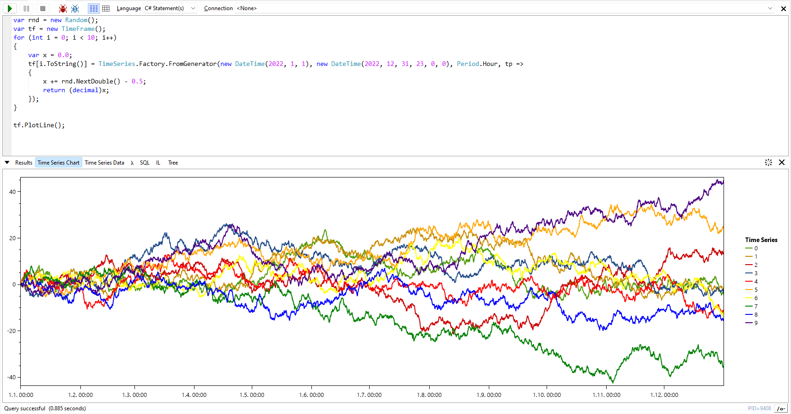
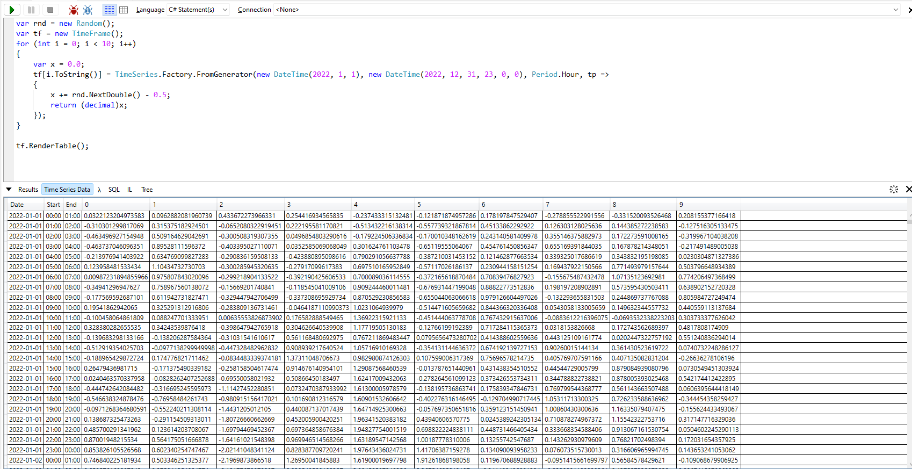

# Thinksharp.TimeFlow.LinqPad

[Thinksharp.TimeFlow](https://github.com/JanDotNet/Thinksharp.TimeFlow) is a simple library for working with time series. **Thinksharp.TimeFlow.LinqPad** provides extension methods for visualizing time series as raw data or charts in LINQPad.

Use `PlotLine()` for rendering `TimeSeries` or `TimeFrame`s as charts.

Use `RenderTable()` for rendering `TimeSeries` or `TimeFrame`s as raw data table.

